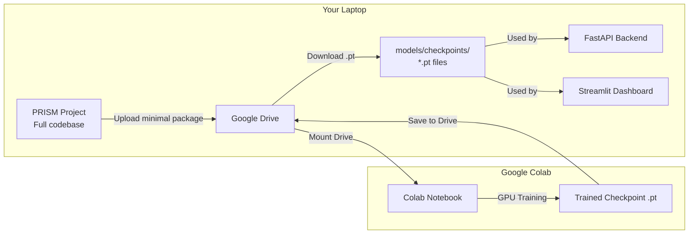
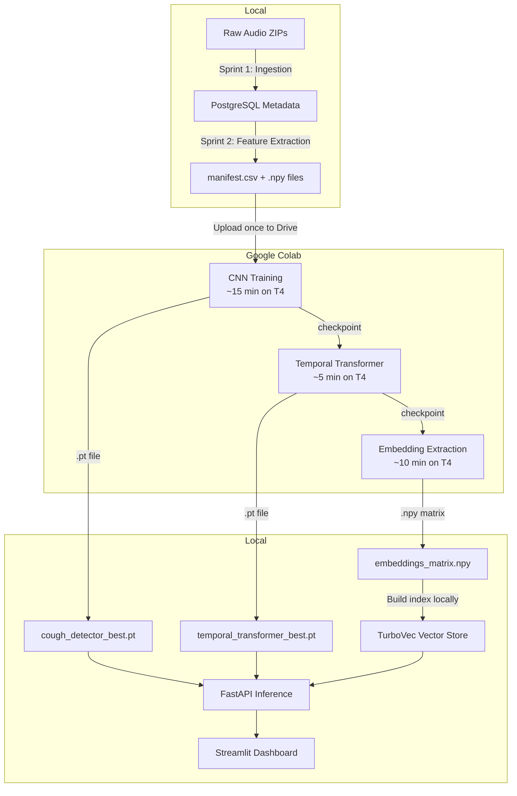

# PRISM: Google Colab Training & Integration Guide

## 1. Why Colab, and Why Not the Full Project?

Your local machine (Intel UHD 620, CPU-only) takes **~6.5 hours per epoch** for the CNN alone. Google Colab provides a free NVIDIA T4 GPU that reduces this to **~7 seconds per epoch**. However, the full PRISM project includes PostgreSQL, FastAPI, Streamlit, Alembic migrations, and 15+ packages that are irrelevant to model training. Uploading and configuring all of that in Colab would be fragile and wasteful.

**The Strategy**: We upload only the **minimum viable training package** — the model code, shared utilities, config, and pre-computed features. Everything else stays local.

---

## 2. What Gets Uploaded to Colab

### The Minimal Training Package

Only these files and folders are needed. Everything else (backend, frontend, database, retrieval, pipelines, Docker, etc.) stays on your local machine.

```
prism-colab/                          # Upload this to Google Drive
├── configs/
│   └── training.yaml                 # Model hyperparameters
├── models/
│   ├── __init__.py
│   ├── shared/
│   │   ├── __init__.py
│   │   ├── transforms.py             # SpecAugment
│   │   ├── metrics.py                # MetricTracker
│   │   └── checkpoint.py             # Save/load utilities
│   ├── cough_detector/
│   │   ├── __init__.py
│   │   ├── model.py                  # ResNet-18 CNN
│   │   ├── dataset.py                # CoughDataset + DataLoader
│   │   ├── train.py                  # Training loop
│   │   ├── run_training.py           # CLI entry point
│   │   └── evaluate.py              # Evaluation script
│   ├── temporal_transformer/         # Sprint 4 (future)
│   │   └── __init__.py
│   └── embeddings/                   # Sprint 4 (future)
│       └── __init__.py
└── checkpoints/                      # Output dir (created during training)
```

### The Features Data

Separately, upload the pre-computed features:

```
datasets-features.zip                  # ~6 GB zip of datasets/features/
├── mel/                               # 131,470 .npy files
│   ├── rec001_seg000.npy
│   └── ...
├── mfcc/                              # 131,470 .npy files
│   └── ...
└── manifest.csv                       # The master index
```

> [!IMPORTANT]
> The features zip is ~6 GB. Upload it to Google Drive **once**. All future training runs (CNN, Transformer, Embeddings) reuse the same data — you never need to upload it again.

---

## 3. Colab Environment Setup

Each Colab notebook begins with the same setup cell. Colab already has PyTorch + CUDA pre-installed, so we only need a few extras:

```python
# === Cell 1: Setup ===
!pip install -q loguru rich scikit-learn pyyaml

# Mount Google Drive
from google.colab import drive
drive.mount('/content/drive')

# Symlink the code and data into the working directory
import os
os.symlink('/content/drive/MyDrive/prism-colab', '/content/prism')
os.symlink('/content/drive/MyDrive/prism-colab/models', '/content/models')

# Unzip features (only needed once per session)
!unzip -q /content/drive/MyDrive/datasets-features.zip -d /content/features

# Verify GPU
import torch
print(f"GPU: {torch.cuda.get_device_name(0)}")
print(f"CUDA: {torch.cuda.is_available()}")
```

---

## 4. Model-by-Model Workflow

### Model 1: CNN Cough Detector (Sprint 3 — Current)

**What it does**: Binary classification (is_cough / not_cough) + 512-dim embedding generation.

**Input data**: `manifest.csv` + `mel/*.npy` files (already generated in Sprint 2).

**Colab training cell**:
```python
# === Cell 2: Train CNN ===
os.chdir('/content/prism')
!python -m models.cough_detector.run_training \
    --manifest /content/features/manifest.csv \
    --features-dir /content/features \
    --epochs 50 \
    --batch-size 128
```

**Expected runtime**: ~15-20 minutes on T4 GPU.

**Output**: `checkpoints/cough_detector_best.pt`

**Evaluation cell**:
```python
# === Cell 3: Evaluate CNN ===
from models.cough_detector.evaluate import run_evaluation
run_evaluation(
    checkpoint_path="checkpoints/cough_detector_best.pt",
    manifest_path="/content/features/manifest.csv",
    features_dir="/content/features",
    output_path="checkpoints/cough_detector_eval.json",
)
```

**Copy checkpoint to Drive**:
```python
# === Cell 4: Save to Drive ===
!cp checkpoints/cough_detector_best.pt /content/drive/MyDrive/prism-colab/checkpoints/
!cp checkpoints/cough_detector_eval.json /content/drive/MyDrive/prism-colab/checkpoints/
```

---

### Model 2: Temporal Transformer (Sprint 4 — Future)

**What it does**: Analyses sequences of cough events across multiple recordings for the same patient over time. Predicts disease progression: Stable → Improving → Increasing → Abnormal.

**Input data**: This model does NOT use raw mel spectrograms. Instead, it consumes **aggregated cough statistics** per recording session:
- `cough_count`, `avg_duration`, `avg_intensity`, `night_ratio`, `inter_cough_interval`

These statistics are derived by running the trained CNN from Model 1 over all recordings for a patient, then aggregating the cough detections per session.

**Colab workflow**:
```
Step 1: Load the trained CNN checkpoint (from Model 1)
Step 2: Run CNN inference on all recordings → per-session cough stats
Step 3: Build temporal sequences (30-day sliding windows per patient)
Step 4: Train the Transformer on these sequences
```

**Why Colab is needed**: The Transformer itself is lightweight (3 layers, 4 heads, 128 dim). Training on Colab would take ~5 minutes. However, Step 2 (running CNN inference on 131K segments) still requires GPU acceleration.

**Output**: `checkpoints/temporal_transformer_best.pt`

---

### Model 3: Embedding Generator + RAG Pipeline (Sprint 4-5)

**What it does**: The 512-dim embedding head is already built into the CNN (Model 1). This phase focuses on:
1. **Generating embeddings** for every segment in the dataset by running the trained CNN in inference mode
2. **Building the TurboVec index** from those embeddings for similarity search
3. **RAG integration** — using retrieved similar cases to generate clinical insights

**Colab workflow**:
```
Step 1: Load trained CNN checkpoint
Step 2: Run inference on all 131K segments → extract 512-dim embeddings
Step 3: Save embeddings as a single .npy matrix (131K × 512 = ~256 MB)
Step 4: Download the embeddings matrix to local machine
```

**Local workflow (after download)**:
```
Step 5: Build TurboVec index locally (CPU-only, fast — it's just vector math)
Step 6: Wire into FastAPI retrieval endpoints
Step 7: Connect to Streamlit dashboard
```

> [!NOTE]
> The TurboVec index building and RAG pipeline do NOT require a GPU. They run efficiently on CPU. Only the embedding extraction (Step 2) needs GPU acceleration via Colab.

---

## 5. Integration: Getting Checkpoints Back Into PRISM

After each Colab training session, you download the checkpoint file(s) and place them into the local project. Here is the exact flow:



### Local integration steps:

```bash
# 1. Download from Google Drive to your local project
#    (Or sync via Google Drive desktop app)

# 2. Place the checkpoint in the expected location:
copy cough_detector_best.pt  C:\Users\Dell\Desktop\PRISM\models\checkpoints\

# 3. The local code automatically discovers it:
#    - evaluate.py reads from models/checkpoints/cough_detector_best.pt
#    - FastAPI inference endpoint loads the same path
#    - Streamlit dashboard uses it for real-time predictions
```

### What the local project does with the checkpoint:
| Component | Uses Checkpoint For |
|-----------|-------------------|
| `evaluate.py` | Running test-set evaluation locally |
| FastAPI `/api/v1/infer` | Real-time cough detection on uploaded audio |
| Embedding pipeline | Extracting 512-dim vectors for TurboVec |
| Streamlit dashboard | Displaying inference results and risk scores |

---

## 6. Complete Lifecycle: Local ↔ Colab



### Summary Table

| Phase | Where | What | GPU Needed? |
|-------|-------|------|-------------|
| Data Ingestion (Sprint 1) | Local | ZIP → PostgreSQL | No |
| Feature Extraction (Sprint 2) | Local | Audio → .npy spectrograms | No |
| CNN Training (Sprint 3) | **Colab** | .npy → trained model | **Yes** |
| Transformer Training (Sprint 4) | **Colab** | Cough stats → trained model | **Yes** |
| Embedding Extraction (Sprint 4) | **Colab** | .npy → 512-dim vectors | **Yes** |
| TurboVec Index (Sprint 5) | Local | Vectors → similarity index | No |
| FastAPI + Streamlit (Sprint 5-6) | Local | Full inference pipeline | No |

---

## 7. Preparing the Upload Package

When you're ready to proceed, I will create a Python script that:
1. Copies only the required files into a clean `prism-colab/` folder
2. Zips `datasets/features/` into `datasets-features.zip`
3. Prints instructions for uploading to Google Drive

You upload two things to Drive:
- `prism-colab/` folder (~50 KB of code)
- `datasets-features.zip` (~6 GB of features, uploaded once, reused forever)

Then open the Colab notebook and click "Run All".
